# 📊 Central Marketing Dashboard

> Unified Marketing Analytics Platform for E-commerce & Advertising

A production-ready ETL pipeline that consolidates data from multiple **Thai e-commerce platforms** (Shopee, Lazada, TikTok Shop) and **advertising platforms** (Facebook Ads, Google Ads, TikTok Ads, LINE Ads) into a unified BigQuery data warehouse with Looker Studio dashboards.


---

## 🎯 Problem Statement

E-commerce businesses in Thailand face a common challenge:

- **Data Fragmentation**: Marketing data scattered across 8+ platforms
- **Manual Reporting**: 2-3 hours daily to compile reports
- **No Cross-Channel View**: Can't see unified ROAS, CAC, or attribution
- **Delayed Insights**: Decisions made on outdated data

**This solution** automates data collection, transformation, and visualization—reducing reporting time from hours to minutes.

---

## 🏗️ Architecture

```mermaid
flowchart TB
    subgraph Sources["📱 Data Sources"]
        direction LR
        subgraph Ecom["E-commerce"]
            Shopee[Shopee]
            Lazada[Lazada]
            TikTok[TikTok Shop]
        end
        subgraph Ads["Advertising"]
            FB[Facebook Ads]
            Google[Google Ads]
            TikTokAds[TikTok Ads]
            LINE[LINE Ads]
        end
        subgraph Analytics["Analytics"]
            GA4[Google Analytics 4]
        end
    end

    subgraph ETL["⚙️ ETL Layer (Python)"]
        Extract[Extractors<br/>Official SDKs + Custom APIs]
        Transform[Transformers<br/>Clean, Normalize, Map SKUs]
        Load[Loaders<br/>BigQuery Client]
    end

    subgraph DW["🗄️ Data Warehouse (BigQuery)"]
        Raw[(Raw Layer<br/>raw_*)]
        Staging[(Staging Layer<br/>stg_*)]
        Mart[(Mart Layer<br/>mart_*)]
    end

    subgraph Orchestration["☁️ Cloud Orchestration"]
        Scheduler[Cloud Scheduler]
        Functions[Cloud Functions]
    end

    subgraph Viz["📈 Visualization"]
        Looker[Looker Studio<br/>5 Dashboard Pages]
    end

    Sources --> Extract
    Extract --> Transform
    Transform --> Load
    Load --> Raw
    Raw --> Staging
    Staging --> Mart
    Scheduler --> Functions
    Functions --> ETL
    Mart --> Looker
```



---

## ✨ Key Features

### 🔌 Multi-Platform Integration
| Platform | Type | Data Collected |
|----------|------|----------------|
| **Shopee** | E-commerce | Orders, Products, Shop Metrics |
| **Lazada** | E-commerce | Orders, Products, Revenue |
| **TikTok Shop** | E-commerce | Orders, Products, Sales |
| **Facebook Ads** | Advertising | Campaigns, Ad Sets, ROAS, CPA |
| **Google Ads** | Advertising | Search, Display, Shopping, PMax |
| **TikTok Ads** | Advertising | Campaigns, Video Performance |
| **LINE Ads** | Advertising | Campaigns, LAP Metrics |
| **GA4** | Analytics | Sessions, Traffic, Conversions |

### 📊 Dashboard Capabilities
- **Executive Overview**: KPIs, Revenue Trends, Alerts
- **Shop Performance**: Cross-platform comparison
- **Ads Performance**: Unified ROAS, Spend, Campaign Table
- **Product Analytics**: Top products, Category breakdown
- **Website Analytics**: GA4 traffic, Conversion funnels

### 🔔 Smart Alerting (Rule-based)
- ROAS below target threshold
- Revenue drop > 20%
- CPA exceeding limits

---

## 🛠️ Tech Stack

| Component | Technology |
|-----------|------------|
| **Language** | Python 3.11+ |
| **ETL** | Custom extractors with Official SDKs |
| **Data Warehouse** | Google BigQuery |
| **Orchestration** | Cloud Scheduler + Cloud Functions |
| **Dashboard** | Google Looker Studio |
| **Secrets** | Google Secret Manager |

### SDK & Libraries
```
facebook-business     # Meta Marketing API
google-ads           # Google Ads API  
google-analytics-data # GA4 Data API
tiktok-business-api-sdk # TikTok Marketing API
google-cloud-bigquery # BigQuery Client
```

---

## 📁 Project Structure

```
central-marketing-dashboard/
├── src/
│   ├── extractors/          # Platform API clients (11 extractors)
│   │   ├── shopee.py        # Shopee Open Platform
│   │   ├── lazada.py        # Lazada Open Platform
│   │   ├── tiktok_shop.py   # TikTok Shop API
│   │   ├── facebook_ads.py  # Meta Marketing API
│   │   ├── google_ads.py    # Google Ads API
│   │   ├── tiktok_ads.py    # TikTok Marketing API
│   │   ├── line_ads.py      # LINE Ads API
│   │   ├── ga4.py           # GA4 Data API
│   │   └── ...
│   ├── transformers/        # Data transformation & normalization
│   ├── loaders/             # BigQuery data loading
│   ├── models/              # Alert models (rule-based)
│   ├── pipelines/           # ETL pipeline orchestration
│   └── utils/               # Helpers (config, logging, currency)
├── sql/
│   ├── schemas/             # BigQuery table schemas
│   └── transformations/     # Mart layer SQL
├── cloud_functions/         # GCP Cloud Functions
├── scripts/
│   ├── setup_gcloud/        # GCP setup scripts
│   └── demo_data/           # Demo data generator
├── tests/                   # Unit & integration tests (200+ tests)
├── config/                  # YAML configurations
└── docs/                    # Technical documentation
```

---

## 🚀 Quick Start

### Prerequisites
- Python 3.11+
- [UV](https://github.com/astral-sh/uv) package manager
- Google Cloud account with billing enabled

### Installation

```bash
# Clone repository
git clone https://github.com/yourusername/central-marketing-dashboard.git
cd central-marketing-dashboard

# Install dependencies
uv sync

# Copy environment template
cp .env.example .env

# Edit .env with your API credentials
```

### Setup GCP Infrastructure

```bash
# Run setup scripts (in order)
./scripts/setup_gcloud/01-create-project.sh
./scripts/setup_gcloud/02-enable-apis.sh
./scripts/setup_gcloud/03-create-service-account.sh
./scripts/setup_gcloud/04-setup-bigquery.sh
./scripts/setup_gcloud/05-setup-secret-manager.sh
./scripts/setup_gcloud/06-create-gcs-bucket.sh
```

### Load Demo Data

```bash
# Generate and load demo data to BigQuery
uv run python scripts/demo_data/load_to_bigquery.py

# Run mart layer transformations
uv run python -m src.main mart
```

### Run Pipelines

```bash
# Run specific pipeline
uv run python -m src.main ecommerce  # E-commerce data
uv run python -m src.main ads        # Advertising data
uv run python -m src.main mart       # Refresh mart layer
uv run python -m src.main alerts     # Generate alerts

# Run all pipelines
uv run python -m src.main all
```

---

## 📊 Data Model

### Three-Layer Architecture

```
┌─────────────────────────────────────────────────────────────┐
│                      RAW LAYER (raw_*)                       │
│  ┌────────────┐ ┌────────────┐ ┌────────────┐ ┌────────────┐ │
│  │raw_shopee_ │ │raw_lazada_ │ │raw_facebook│ │raw_google_ │ │
│  │  orders    │ │  orders    │ │   _ads     │ │   ads      │ │
│  └────────────┘ └────────────┘ └────────────┘ └────────────┘ │
└──────────────────────────┬──────────────────────────────────┘
                           ▼
┌─────────────────────────────────────────────────────────────┐
│                   STAGING LAYER (stg_*)                      │
│  ┌────────────────┐ ┌────────────────┐ ┌──────────────────┐ │
│  │   stg_orders   │ │stg_ads_perform │ │  stg_ga4_traffic │ │
│  │   (unified)    │ │    (unified)   │ │                  │ │
│  └────────────────┘ └────────────────┘ └──────────────────┘ │
└──────────────────────────┬──────────────────────────────────┘
                           ▼
┌─────────────────────────────────────────────────────────────┐
│                     MART LAYER (mart_*)                      │
│  ┌──────────────┐ ┌──────────────┐ ┌──────────────────────┐ │
│  │mart_daily_   │ │ mart_shop_   │ │mart_campaign_perform │ │
│  │ performance  │ │ performance  │ │                      │ │
│  └──────────────┘ └──────────────┘ └──────────────────────┘ │
└─────────────────────────────────────────────────────────────┘
```

---

## 🧪 Testing

```bash
# Run all tests
uv run pytest

# Run with coverage
uv run pytest --cov=src --cov-report=html

# Run specific test module
uv run pytest tests/test_extractors/test_shopee.py -v
```

**Test Coverage**: 200+ unit tests covering extractors, transformers, and pipelines.

---

## 📈 Business Impact

| Metric | Before | After |
|--------|--------|-------|
| **Report Generation** | 2-3 hours/day | 5 minutes |
| **Data Freshness** | 24-48 hours | 6 hours |
| **Platform Coverage** | Manual per platform | 8 platforms unified |
| **Cross-Channel View** | Not possible | Full attribution |

---

## 📚 Documentation

- [Product Specification](.docs/01-spec.md) - Business requirements & user stories
- [Technical Plan](.docs/02-plan.md) - Architecture & implementation details
- [Development Tasks](.docs/03-tasks.md) - Task breakdown & progress
- [Dashboard Specification](docs/dashboard-specification.md) - Looker Studio design
- [Looker Studio Setup](docs/looker-studio-setup.md) - Step-by-step guide

---

## 🗺️ Roadmap

### Phase 1 (Current) - Single Tenant MVP
- [x] E-commerce extractors (Shopee, Lazada, TikTok Shop)
- [x] Ads extractors (Facebook, Google, TikTok, LINE)
- [x] GA4 integration
- [x] BigQuery data warehouse
- [x] Cloud Functions deployment
- [x] Demo data generator
- [ ] Looker Studio dashboards (5 pages)

### Phase 2 (Future) - Multi-Tenant SaaS
- [ ] User authentication (Firebase Auth)
- [ ] Multi-tenant data isolation
- [ ] Self-service platform connection
- [ ] Subscription & billing
- [ ] Advanced ML recommendations

---

## 🤝 Contributing

Contributions are welcome! Please read the contributing guidelines before submitting PRs.

---

## 📄 License

This project is licensed under the MIT License - see the [LICENSE](LICENSE) file for details.

---

## 👤 Author

Built with ❤️ for Thai E-commerce businesses

---

*Last updated: December 2025*